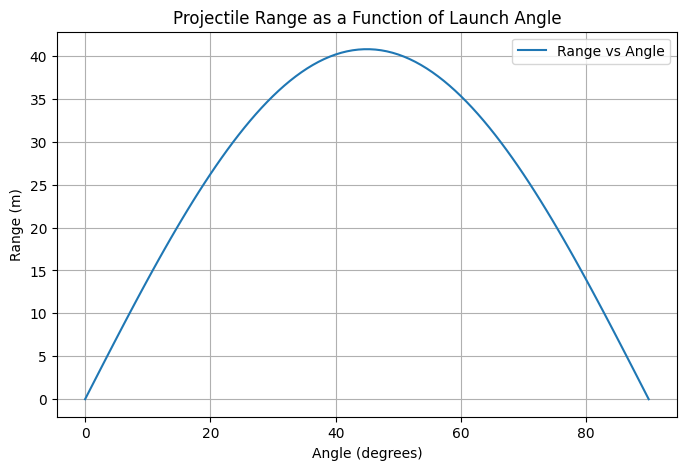
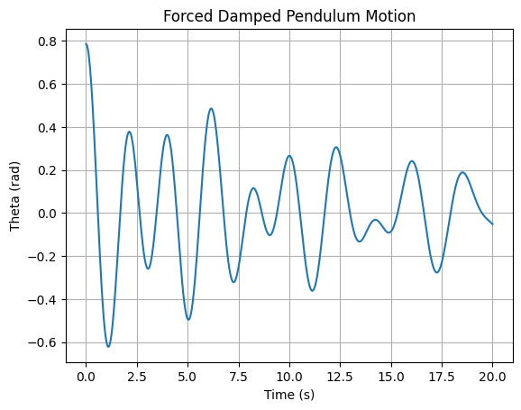
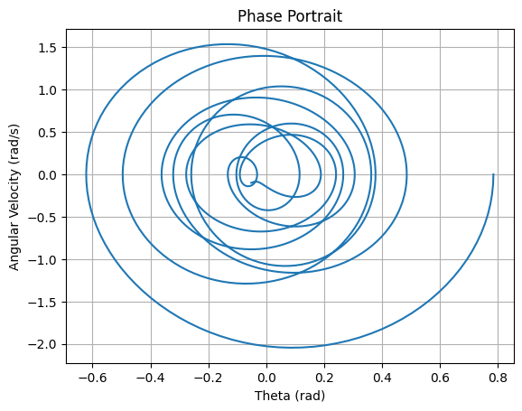

# Problem 1
# Investigating the Range as a Function of the Angle of Projection

## Motivation
Projectile motion, while seemingly simple, offers a rich playground for exploring fundamental principles of physics. The problem is straightforward: analyze how the range of a projectile depends on its angle of projection. Yet, beneath this simplicity lies a complex and versatile framework. The equations governing projectile motion involve both linear and quadratic relationships, making them accessible yet deeply insightful.

What makes this topic particularly compelling is the number of free parameters involved in these equations, such as initial velocity, gravitational acceleration, and launch height. These parameters give rise to a diverse set of solutions that can describe a wide array of real-world phenomena, from the arc of a soccer ball to the trajectory of a rocket.

## Theoretical Foundation
The equations governing projectile motion can be derived using Newton’s second law:

- Horizontal motion:
  $$ x = v_0 \cos(\theta) t $$
- Vertical motion:
  $$y = v_0 \sin(\theta) t - \frac{1}{2} g t^2 $$

To find the range, we determine the time when the projectile returns to the ground $$ y = 0 $$:
  $$ t = \frac{2 v_0 \sin(\theta)}{g} $$

Substituting this into the horizontal equation, the range $$ R $$ is given by:
  $$ R = \frac{v_0^2 \sin(2\theta)}{g} $$

This formula highlights how range depends on the angle of projection, with a maximum occurring at $$ \theta = 45^\circ $$.

## Analysis of the Range
- The range is maximized at $$ 45^\circ $$ .
- For a fixed initial velocity, doubling the gravitational acceleration halves the range.
- If air resistance is considered, the range is reduced.

## Practical Applications
- Sports (soccer, basketball, javelin throw)
- Engineering (missile trajectories, ballistics)
- Space exploration (rocket launches)

## Implementation
We implement a Python script to simulate projectile motion and visualize range vs. angle.


---

# Investigating the Dynamics of a Forced Damped Pendulum

## Motivation
The forced damped pendulum is a captivating example of a physical system with intricate behavior resulting from the interplay of damping, restoring forces, and external driving forces. These phenomena serve as a foundation for understanding complex real-world systems, such as driven oscillators, climate systems, and mechanical structures under periodic stress.

## Theoretical Foundation
The equation governing a forced damped pendulum is:

$$ \ddot{\theta} + b \dot{\theta} + \frac{g}{L} \sin(\theta) = A \cos(\omega t) $$

For small angles, $$ \sin(\theta) \approx \theta $$, leading to a linearized equation that can be solved analytically. However, for large angles, numerical solutions are needed.

## Analysis of Dynamics
- Low damping leads to oscillations close to simple harmonic motion.
- At resonance, the system absorbs maximum energy.
- With high forcing, chaotic behavior can emerge.

## Practical Applications
- Energy harvesting
- Suspension bridges (Tacoma Narrows collapse)
- Oscillating circuits (RLC circuits)

## Implementation
We solve the equation numerically using the Runge-Kutta method.



### Phase Space Analysis
We also plot the phase portrait.


```

 Deliverables
- Theoretical derivations of projectile motion and forced damped pendulum dynamics.
- Python implementations for simulations and visualizations.
- Discussions on real-world applications and model limitations.

These analyses provide insights into classical mechanics while connecting them to modern engineering and s![alt text]cientific applications.

