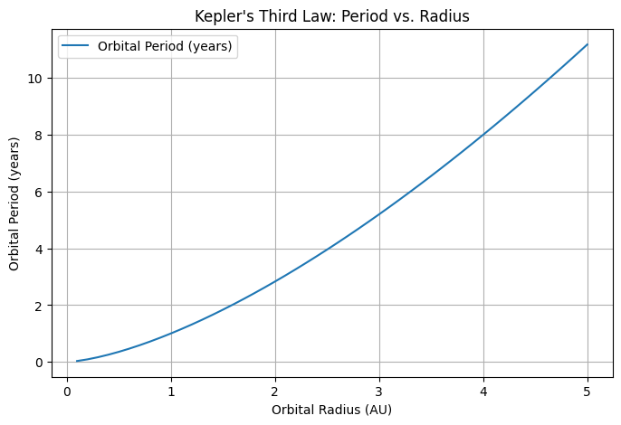
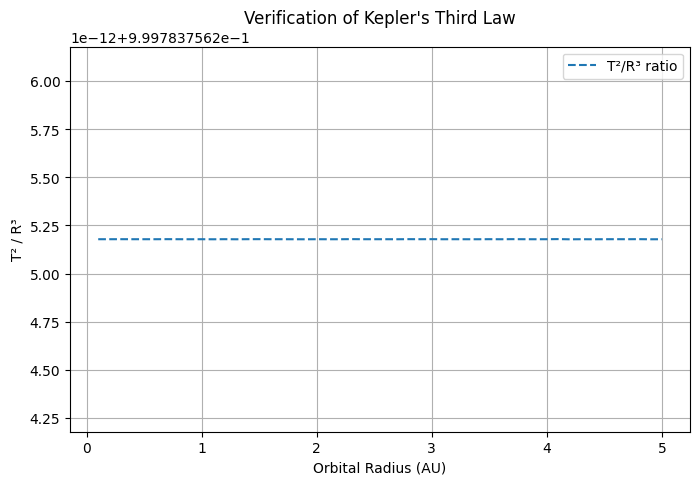
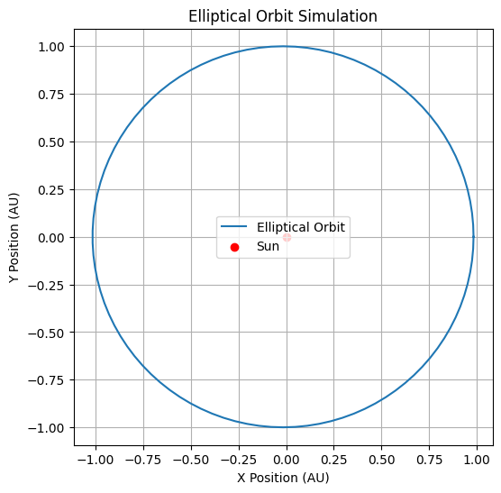

# Problem 1
---

# **Kepler's Third Law and Orbital Motion Analysis**

## **Introduction**
Kepler's Third Law states that the square of a planet's orbital period is proportional to the cube of its semi-major axis:

$$
T^2 \propto R^3
$$

where:
-  T is the orbital period,
- R  is the semi-major axis (for circular orbits, the orbital radius),
- The proportionality constant depends on the mass of the central body.

This relationship provides crucial insights into planetary motion, helping astronomers determine distances and masses of celestial bodies.

---

## **1. Understanding Kepler’s Third Law in Circular Orbits**
For a circular orbit, the gravitational force provides the necessary centripetal force:

$$
\frac{G M m}{R^2} = \frac{m v^2}{R}
$$

where:
- G is the gravitational constant $$ 6.674 \times 10^{-11} \, m^3 kg^{-1} s^{-2}\ $$
- \(M\) is the mass of the central body (e.g., the Sun),
- \(m\) is the mass of the orbiting body,
- \(R\) is the orbital radius,
- \(v\) is the orbital velocity.

Since velocity is related to the period by $$ v = \frac{2 \pi R}{T} $$, substituting into the equation above gives:

$$
T^2 = \frac{4 \pi^2 R^3}{G M}
$$

This confirms the proportionality $$T^2 \propto R^3$$

---

## **2. Computational Implementation for Circular Orbits**
### **Code Breakdown**
- The function `orbital_period(radius, mass_center)` calculates the orbital period using Kepler’s Third Law.
- We define a range of orbital radii (from 0.1 to 5 AU).
- Using the function, we compute the corresponding orbital periods.
- We verify the relationship $$T^2 / R^3 $$ remains constant.

### **Graphical Representation**
1. **Orbital Period vs. Orbital Radius:** The first plot shows the dependence of orbital period on radius.
2. **Kepler’s Verification Plot:** The second plot confirms that $$T^2 / R^3$$ is approximately constant.

---

## **3. Extending to Elliptical Orbits**
### **Elliptical Motion**
Kepler's First Law states that planetary orbits are elliptical, with the Sun at one focus. The equation for an elliptical orbit is:

$$
r = \frac{a (1 - e^2)}{1 + e \cos \theta}
$$

where:
- a is the semi-major axis,
- e$ is the eccentricity (0 for a perfect circle, close to 1 for a highly elliptical orbit),
- $(\theta)$  is the true anomaly (angle in the orbital plane).

### **Elliptical Orbit Simulation**
- The function `elliptical_orbit(a, e)` calculates the positions of an orbiting body.
- We simulate Earth's orbit with \( a = 1 \) AU and \( e = 0.0167 \).
- The final plot visually represents an elliptical orbit.

---

## **4. Applications and Implications**
- **Planetary Masses:** By measuring orbital periods and radii, astronomers estimate the masses of planets and stars.
- **Satellite Orbits:** Kepler's Laws help design satellite trajectories around Earth.
- **Exoplanet Discovery:** Observing periodic brightness dips in distant stars (due to orbiting planets) provides exoplanet data.

