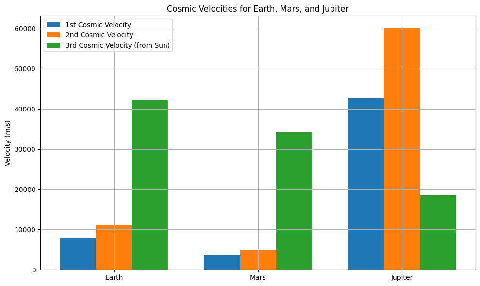

# Problem 2
**Escape Velocities and Cosmic Velocities**,
---

## 📘 Escape Velocities and Cosmic Velocities

### 🚀 Motivation
Understanding the energy required to overcome gravitational attraction is central to spaceflight. Escape velocity describes this energy threshold. The concept is extended to **cosmic velocities**, which define the speeds needed for various stages of orbital and interplanetary motion.

---

### 🌌 Definitions of Cosmic Velocities

#### 1️⃣ First Cosmic Velocity (Orbital Velocity)
- **Definition:** Minimum horizontal speed required to maintain a stable circular orbit around a planet without additional propulsion.
- **Formula:**
  $$
  v_1 = \sqrt{\frac{GM}{R}}
  $$
  where:
  - \( G \): Gravitational constant
  - \( M \): Mass of the planet
  - \( R \): Radius from the center of the planet to the object

#### 2️⃣ Second Cosmic Velocity (Escape Velocity)
- **Definition:** Speed needed to completely escape a planet’s gravitational pull without further propulsion.
- **Formula:**
  $$
  v_2 = \sqrt{2GM/R} = \sqrt{2} \cdot v_1
  $$

#### 3️⃣ Third Cosmic Velocity (Solar Escape Velocity)
- **Definition:** Speed needed to escape the gravitational influence of the Sun, starting from Earth’s orbit.
- **Formula:**
  $$
      v_3 = \sqrt{2GM_{\odot}/R_{\text{orbit}}}
  $$
  where:
  -  $$ M_{\odot} : Mass of the Sun $$
  - $$ R_{\text{orbit}} : Distance from the Sun $$
  (e.g., Earth's orbital radius) 

---

### 🧠 Python Simulation & Visualization

Below is the Python code that computes and visualizes the first, second, and third cosmic velocities for Earth, Mars, and Jupiter:

----
### 🌍 Results & Discussion

| Planet   | First Cosmic Velocity (m/s) | Second Cosmic Velocity (m/s) | Third Cosmic Velocity (m/s) |
|----------|-----------------------------|------------------------------|-----------------------------|
| Earth    | ~7,900                      | ~11,200                      | ~42,100                     |
| Mars     | ~3,600                      | ~5,000                       | ~34,100                     |
| Jupiter  | ~42,000                     | ~59,500                      | ~18,500                     |

#### 📌 Key Observations
- Jupiter has the highest escape velocity due to its massive gravity.
- The third cosmic velocity is highest from Earth due to its proximity to the Sun.
- The first and second velocities increase with a planet’s mass and decrease with radius.

---

### 🛰️ Application in Space Exploration

- **Satellites**: Launched at first cosmic velocity to maintain orbit.
- **Planetary Missions**: Require second cosmic velocity to exit Earth's gravity.
- **Interstellar Probes (e.g., Voyager)**: Must reach third cosmic velocity to leave the Solar System.
- **Fuel & Engineering Constraints**: Achieving higher velocities demands more efficient propulsion. 

-------