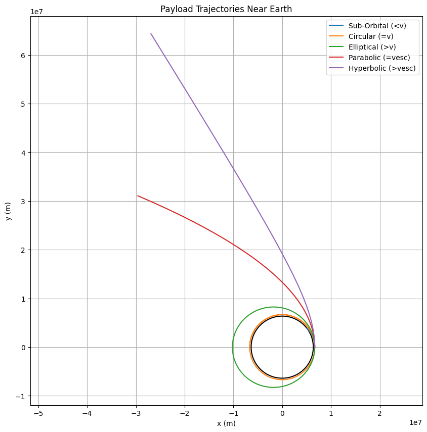
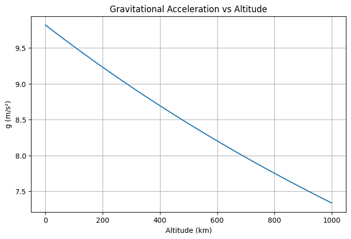
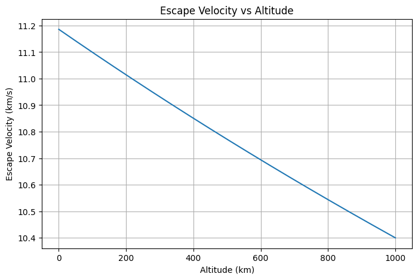

# Problem 3
---

# **Trajectories of a Freely Released Payload Near Earth**

## **1. Introduction**

When a payload is released from a moving rocket near Earth, it can follow different types of trajectories—elliptical, parabolic, or hyperbolic—depending on its initial velocity and direction. These trajectories are governed by Newtonian gravity and are foundational in space mission planning, from orbital insertions to interplanetary escape.

---

## **2. Theoretical Background**

We analyze motion under the influence of gravity using:

* **Newton’s Law of Universal Gravitation**:

  $$
  F = G \frac{M_e m}{r^2}
  $$

* **Orbital Energy Equation** (specific mechanical energy):

  $$
  \epsilon = \frac{v^2}{2} - \frac{GM_e}{r}
  $$

Where:

* $\epsilon < 0$ → elliptical orbit

* $\epsilon = 0$ → parabolic escape trajectory

* $\epsilon > 0$ → hyperbolic trajectory

* **Escape Velocity**:

  $$
  v_{esc} = \sqrt{\frac{2GM_e}{r}}
  $$

---

## **3. Simulation Method**

We simulate the payload motion using the velocity-Verlet or Euler method:

* Define initial position and velocity
* Apply gravitational acceleration at each time step
* Update position and velocity iteratively

---

## **4. Python Simulation**

---

## **5. Analysis**

### **Elliptical Orbit**

When the initial speed is less than escape velocity but more than required for a circular orbit, the object enters an elliptical orbit around Earth.

### **Parabolic Trajectory**

At exactly escape velocity, the trajectory becomes parabolic—barely escaping Earth's gravity with zero excess energy.

### **Hyperbolic Trajectory**

When the initial speed exceeds escape velocity, the object follows a hyperbolic path and escapes Earth with leftover kinetic energy.

### **Sub-Orbital Flight**

If the velocity is less than required for orbit, the payload reenters Earth's atmosphere and impacts the surface.

---

## **6. Applications**

* **Orbital Insertion**: Matching orbital velocity is critical for satellite deployment.
* **Reentry Scenarios**: Understanding sub-orbital paths helps with crew capsule recovery.
* **Escape Trajectories**: Required for interplanetary missions like Mars rovers.

---

## **7. Conclusion**

By adjusting initial conditions, we demonstrate all classical trajectory types near Earth. This simulation supports planning for satellite launches, reentry capsules, and interplanetary probes.

---
---

# ✅ Enhanced Notebook with Notes and Diagrams

### **1. Gravitational Field Around Earth**

We start by visualizing the gravitational field and escape velocity curve to understand the influence of Earth’s gravity.

**Note:** Gravitational force weakens with altitude, dropping rapidly beyond 300 km. This helps explain why less force is needed for trajectory corrections at high orbits.

---

### **2. Escape Velocity vs Altitude**

**Note:** Escape velocity at Earth's surface is \~11.2 km/s, but it decreases with altitude. At 300 km, it’s about 10.9 km/s—important for mission planners choosing release altitudes.

---
