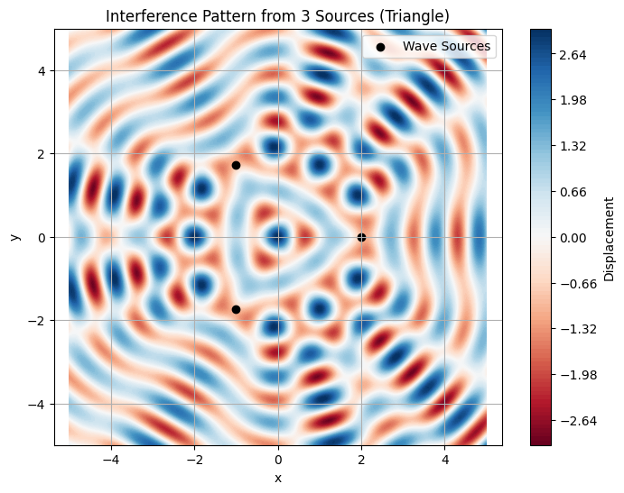

# Problem 1
---
# 🌊 Interference Patterns on a Water Surface from Regular Polygon Sources

## Motivation

Interference occurs when waves from different sources overlap, creating complex patterns due to constructive (amplifying) and destructive (canceling) interference. This is vividly observable on a water surface, where circular ripples meet and interact.

Understanding these patterns helps us visualize core principles of wave physics, including phase, coherence, and superposition. In this study, we analyze such patterns for coherent wave sources arranged in a **regular polygon**.

---

## Problem Setup

### Assumptions

* All sources emit circular, coherent water waves.
* Same amplitude $A$, wavelength $\lambda$, and frequency $f$.
* Waves are in phase (phase difference = 0).
* Medium (water) is uniform.

### Wave Function

For a point source at position $\mathbf{r}_i$, the wave at position $\mathbf{r}$ and time $t$ is given by:

$$
u_i(\mathbf{r}, t) = A \cdot \cos(k|\mathbf{r} - \mathbf{r}_i| - \omega t)
$$

Where:

* $A$: amplitude
* $k = \frac{2\pi}{\lambda}$: wave number
* $\omega = 2\pi f$: angular frequency
* $|\mathbf{r} - \mathbf{r}_i|$: distance from source $i$ to point $\mathbf{r}$

Total wave displacement:

$$
u(\mathbf{r}, t) = \sum_{i=1}^{N} u_i(\mathbf{r}, t)
$$

---

## 🔢 Python Simulation (Square: 4 Sources)

---

## 🔍 Observations & Analysis

### Constructive Interference

* Occurs where wave crests from multiple sources align (phase match).
* Appears as **bright ridges** or intense colors in the plot.

### Destructive Interference

* Occurs where crests and troughs cancel out.
* Visible as **nulls or dark bands** in the interference map.

### Pattern Symmetry

* Because of the regular square arrangement, the pattern exhibits **fourfold rotational symmetry**.
* Interference maxima and minima appear periodically along radial directions.

---

## 🧠 Conclusion

This simulation illustrates how coherent sources arranged in a geometric pattern (here, a square) produce predictable, symmetric interference effects. It reinforces the power of wave superposition in understanding both physical and engineering systems, including optics, acoustics, and quantum mechanics.

This approach can be extended to triangles, pentagons, or arbitrary source layouts to explore further wave phenomena.

---

| Shape    | Symmetry | Notes                                             |
| -------- | -------- | ------------------------------------------------- |
| Triangle | 3-fold   | Interference zones form 120° radial symmetries.   |
| Square   | 4-fold   | Interference lobes are evenly spaced at 90°.      |
| Pentagon | 5-fold   | More complex, but beautiful star-like symmetries. |

---

### 🔑 Key Takeaways:

1. **Wave Superposition is Predictable and Patterned**:

   * The overlapping of waves from multiple point sources leads to stable regions of **constructive** and **destructive interference**, governed by distance and phase alignment.

2. **Geometry Defines the Symmetry**:

   * The **shape of the polygon** (triangle, square, pentagon) determines the **rotational symmetry** of the resulting pattern:

     * **Triangle** → 3-fold symmetry
     * **Square** → 4-fold symmetry
     * **Pentagon** → 5-fold symmetry

3. **Constructive Interference**:

   * Occurs where crests align → **bright/intense regions**.
   * Symmetrically distributed from the center outward.

4. **Destructive Interference**:

   * Occurs where crests and troughs cancel out → **nulls or dark fringes**.
   * Forms a grid or radial node structure depending on the polygon.

5. **Number of Sources Affects Complexity**:

   * More sources → denser interference zones and **more intricate patterns**.
   * For higher-order polygons, the central and radial features become more star-like and visually rich.

---
