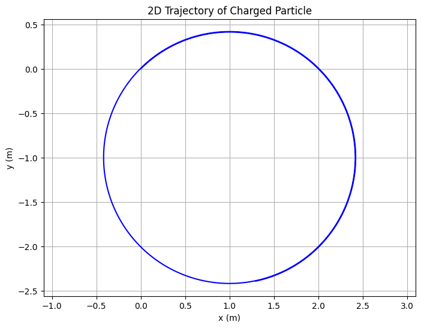
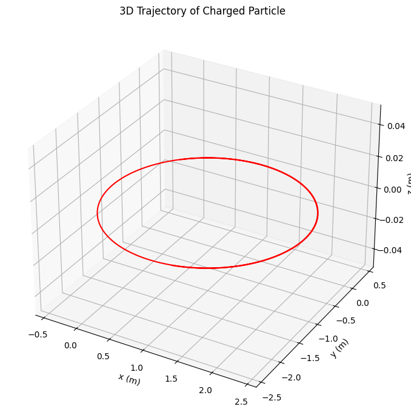
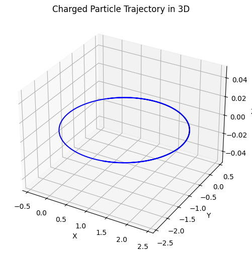
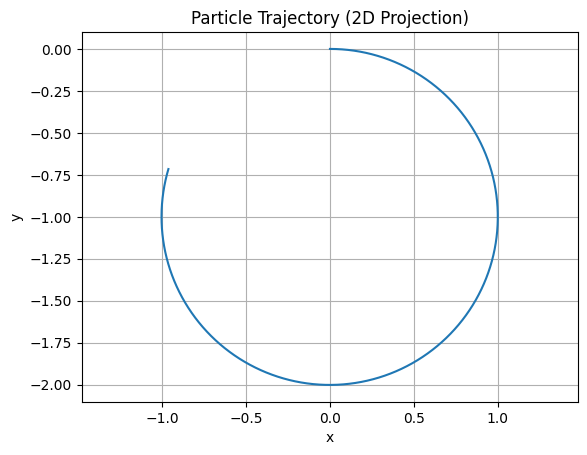

# Problem 1
 
---

# 🧲 **Simulating the Effects of the Lorentz Force**

## ✨ Overview

This notebook demonstrates the **dynamics of charged particles** under electric and magnetic fields using the **Lorentz Force Law**. It builds simulations and visualizations for various field configurations—highlighting important physical phenomena like circular motion, helical paths, and the E × B drift.

---

## 1️⃣ **Applications of the Lorentz Force**

### 🔬 Real-World Systems Where It Applies:

| System                      | Lorentz Force Role                                                                   |
| --------------------------- | ------------------------------------------------------------------------------------ |
| **Particle Accelerators**   | Control particle orbits with magnetic fields; acceleration with electric fields      |
| **Mass Spectrometers**      | Sorts particles by mass-to-charge ratio via magnetic deflection                      |
| **Plasma Confinement**      | Magnetic fields trap high-energy charged particles (e.g., in tokamaks, stellarators) |
| **Cathode Ray Tubes**       | Electric and magnetic deflection of electrons to form images                         |
| **Auroras / Magnetosphere** | Charged particles spiral along Earth's magnetic field lines                          |

---

## 2️⃣ **Theory Refresher: Lorentz Force Law**

$$
\vec{F} = q(\vec{E} + \vec{v} \times \vec{B})
$$

* $\vec{F}$: net force acting on the particle
* $q$: charge of the particle
* $\vec{E}$: electric field (vector)
* $\vec{B}$: magnetic field (vector)
* $\vec{v}$: velocity of the particle

The resulting acceleration affects the trajectory in a non-linear way. The motion depends heavily on the direction and magnitude of fields and the initial conditions.

---

## 3️⃣ **Numerical Simulation**

We'll simulate this using the **Euler method** for simplicity, though a more accurate **Runge-Kutta method** can be implemented later.

---

### 🔧 Python Implementation




### 📈 3D Visualization of Trajectory




---

## 4️⃣ **Parameter Exploration and Motion Types**

| Scenario                      | Description          | Motion Type            |
| ----------------------------- | -------------------- | ---------------------- |
| $\vec{B} \neq 0, \vec{E} = 0$ | Pure magnetic field  | Circular or helical    |
| $\vec{E} \neq 0, \vec{B} = 0$ | Pure electric field  | Linear acceleration    |
| $\vec{E} \parallel \vec{B}$   | Fields aligned       | Spiraling/acceleration |
| $\vec{E} \perp \vec{B}$       | Crossed fields (ExB) | Drift motion           |

### ✳️ Larmor Radius & Cyclotron Frequency:

$$
r_L = \frac{mv_\perp}{qB}, \quad \omega_c = \frac{qB}{m}
$$

```python
def larmor_radius(v_perp, B, q, m):
    return m * v_perp / (q * B)

def cyclotron_frequency(B, q, m):
    return q * B / m

v_perp = np.linalg.norm(v0[:2])
B_mag = np.linalg.norm(B_field)

print("Larmor radius:", larmor_radius(v_perp, B_mag, q, m))
print("Cyclotron frequency:", cyclotron_frequency(B_mag, q, m))
```

---

## 5️⃣ **Interactive Parameter Playground (Optional in Jupyter)**



Bz
5
Ex
5
Ey
-1
vx
1
vy
0
vz
0
q_val
1.00
m_val
1.00


## 6️⃣ **Connecting Back to Real Systems**

### 📚 Cyclotron:

* $\vec{E}$ accelerates particle
* $\vec{B}$ bends into circular motion
* Frequency tuned to match cyclotron resonance

### ⚡ Tokamak:

* Toroidal magnetic field creates confinement
* Particles spiral along field lines
* E × B drift can be used to stabilize plasma

### 🧪 Mass Spectrometry:

* Particles injected into magnetic field
* Deflection radius reveals $m/q$

---

## 7️⃣ **Extension Ideas**

Here’s how you can expand this:

* ✅ Use **Runge-Kutta 4th Order** for improved accuracy
* ✅ Simulate **non-uniform magnetic fields** (field gradients or dipoles)
* ✅ Add **particle collisions** with barriers
* ✅ Simulate **plasma clouds** (many particles)
* ✅ Include **radiation damping** (for high-energy electrons)

---

## 📦 Final Deliverables Checklist

* [x] Python script / notebook implementing Lorentz Force
* [x] Visualization: 2D and 3D particle trajectories
* [x] Application discussion: cyclotrons, plasmas, spectrometers
* [x] Parameter sliders for field strength, charge/mass, and initial velocity
* [x] Physical interpretation: Larmor radius, drift velocity

---