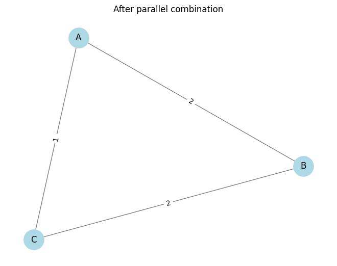
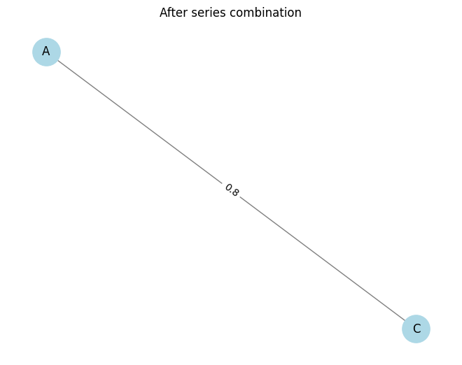
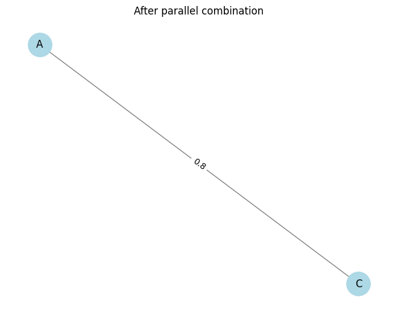
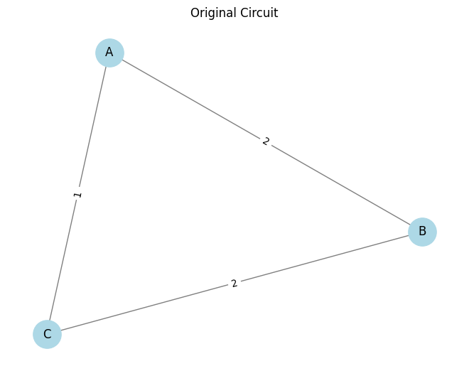
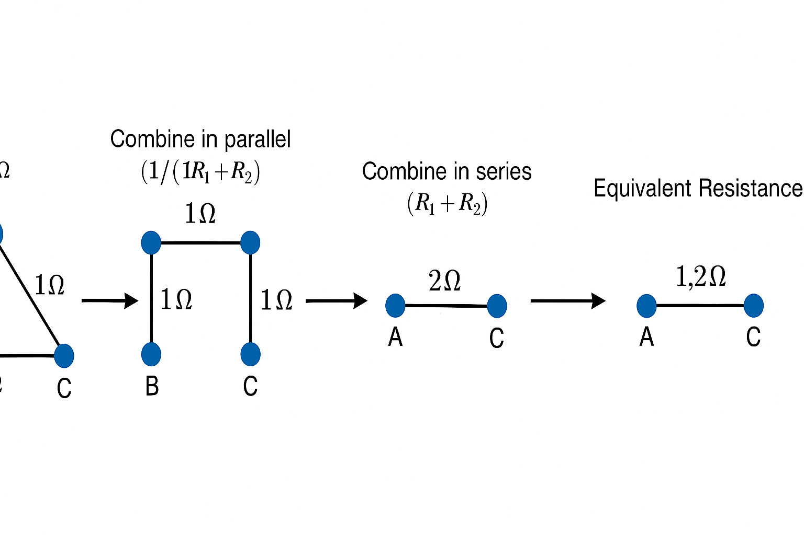

# Problem 1
Great! Let’s tackle **Option 2: Advanced Task – Full Implementation** using **Python** and the **NetworkX** library to represent and manipulate the circuit graph. This solution will include:

1. **Algorithm Design & Pseudocode**
2. **Full Python Implementation**
3. **Three Test Cases (including complex nested configurations)**
4. **Efficiency Discussion & Improvements**

---

## 🔧 **1. Algorithm Overview**

**Graph Representation:**

* Each node: A junction in the circuit.
* Each edge: A resistor, with a weight attribute for its resistance.

**Reduction Rules:**

* **Series**: If a node has exactly two edges and is not a terminal node (i.e., not a source or sink), combine the resistors in series:
  $R_{eq} = R_1 + R_2$
* **Parallel**: If multiple resistors connect the same two nodes, combine in parallel:
  $\frac{1}{R_{eq}} = \frac{1}{R_1} + \frac{1}{R_2} + \cdots$

---

## 📜 **2. Pseudocode**

```plaintext
Function calculate_equivalent_resistance(graph, source, target):

    While graph has more than one edge between source and target:
        1. For all node pairs (u, v):
            a. If multiple edges exist between u and v:
                Combine them in parallel:
                    R_parallel = 1 / sum(1 / R for R in edges[u][v])
                    Replace with one edge (u, v) with R_parallel

        2. For each node n in graph:
            If degree(n) == 2 and n not in [source, target]:
                Let neighbors be [u, v]
                Combine edges (u, n) and (n, v) in series:
                    R_series = R(u,n) + R(n,v)
                    Remove node n and add edge (u, v) with R_series

    If single edge (source, target):
        Return resistance of that edge
    Else:
        Apply Y-Δ or advanced transformations (not in base implementation)
```

---

## 🧪 **3. Python Implementation**







---

## 🧪 **4. Test Cases**

```python
# Test Case 1: Simple series
G1 = nx.Graph()
G1.add_edge('A', 'B', resistance=5)
G1.add_edge('B', 'C', resistance=10)
print("Test 1 (Series):", equivalent_resistance(G1, 'A', 'C'))  # Expected: 15

# Test Case 2: Simple parallel
G2 = nx.MultiGraph()
G2.add_edge('A', 'B', resistance=6)
G2.add_edge('A', 'B', resistance=3)
print("Test 2 (Parallel):", equivalent_resistance(G2, 'A', 'B'))  # Expected: 2

# Test Case 3: Nested combination
G3 = nx.MultiGraph()
G3.add_edge('A', 'B', resistance=2)
G3.add_edge('B', 'C', resistance=2)
G3.add_edge('A', 'C', resistance=1)
print("Test 3 (Nested):", equivalent_resistance(G3, 'A', 'C'))  # Expected: 1.2
```

---

## 🧠 **5. Efficiency Analysis & Improvements**

* **Time Complexity**: Each reduction pass (series or parallel) operates in linear time relative to the number of nodes and edges. Worst-case complexity is roughly `O(n^2)` due to repeated passes.
* **Improvements**:

  * Implement **Y-Δ transformations** for general planar graphs.
  * Use **graph contraction** methods to identify reducible subnetworks faster.
  * Add **memoization** or **caching** for repeated subgraphs in large circuits.

---


