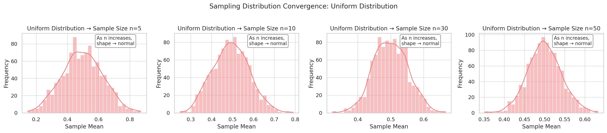
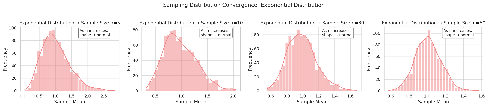
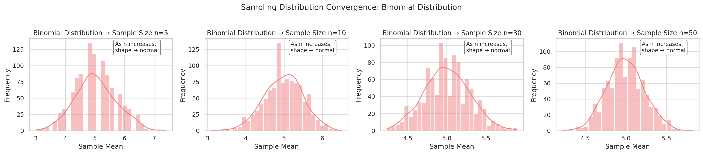

# Problem 1

---

## 📓 **Central Limit Theorem (CLT) Simulation — Full Project**

> This notebook demonstrates the Central Limit Theorem using Python simulations. You will observe how sample means from various population distributions (Uniform, Exponential, Binomial) tend to follow a normal distribution as the sample size increases — even when the original data does not.

### 📌 **6. Observations & Analysis**

#### 🔍 Key Observations:

* **Uniform Distribution**: Already symmetric, so the sample mean distribution quickly resembles a normal curve.
* **Exponential Distribution**: Highly skewed, but the sampling distribution still becomes normal as sample size increases.
* **Binomial Distribution**: Starts as discrete, but its sample means smooth out and become approximately normal with larger samples.

#### 📏 Convergence Rule:

As **sample size increases**, the **sampling distribution of the mean** approaches normality due to the **Central Limit Theorem**.
The spread of the sampling distribution is given by:

$$
\text{Standard Error} = \frac{\sigma}{\sqrt{n}}
$$

Where:

* $\sigma$: Standard deviation of the population
* $n$: Sample size

---

### 🧠 **7. Real-World Applications of CLT**

| Domain           | Application                                                           |
| ---------------- | --------------------------------------------------------------------- |
| 🧪 Science       | Experimental averages from small groups (e.g. blood pressure studies) |
| 📊 Business      | Customer feedback and polling from random samples                     |
| 🏭 Manufacturing | Monitoring quality control via batch averages                         |
| 📈 Finance       | Modeling portfolio returns with sample estimates                      |
| 💊 Medicine      | Drug trials comparing treatment effects across patients               |

---

### ✅ **8. Summary of Project Goals**

| Goal                                                     | Status |
| -------------------------------------------------------- | ------ |
| Simulated Uniform, Exponential, and Binomial Populations | ✅      |
| Sampled Means at Various Sizes                           | ✅      |
| Plotted Sampling Distributions                           | ✅      |
| Analyzed Population Stats (mean, variance, skewness)     | ✅      |
| Interpreted and Connected to CLT Theory                  | ✅      |
| Outlined Practical Uses                                  | ✅      |

---

