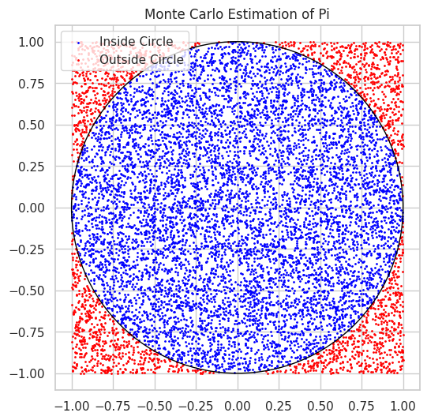
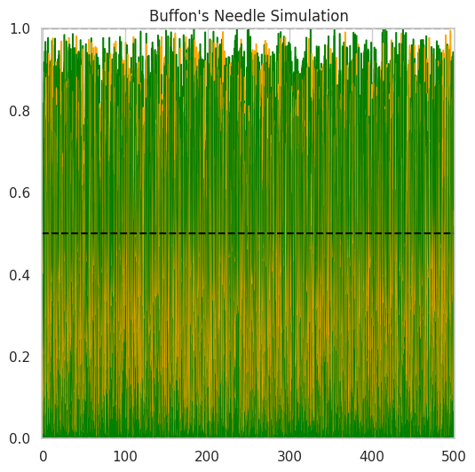
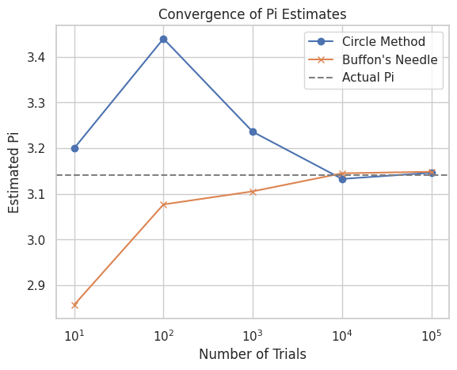

# Problem 2
 Monte Carlo estimation project

### ✅ Part 1: Circle-Based Estimation

* Generates random `(x, y)` points in a square bounding a unit circle.
* Calculates π using the ratio:

  $$
  \pi \approx 4 \times \frac{\text{Points inside circle}}{\text{Total points}}
  $$
* Includes a visualization to differentiate points inside vs outside the circle.

### ✅ Part 2: Buffon’s Needle

* Simulates dropping a needle on a floor with parallel lines.
* Uses the formula:

  $$
  \pi \approx \frac{2 \cdot L \cdot N}{d \cdot C}
  $$

  where `L` = needle length, `N` = total drops, `d` = distance between lines, `C` = crosses.

| Aspect                 | Circle Method                      | Buffon’s Needle Method                    |
| ---------------------- | ---------------------------------- | ----------------------------------------- |
| Principle              | Geometric probability in 2D square | Probability of crossing lines on a plane  |
| Key formula for π      | $\pi \approx 4 \times \frac{M}{N}$ | $\pi \approx \frac{2 l N}{d M}$           |
| Type of random samples | Points uniformly in a square       | Needle drops with random position & angle |
| Intuition              | Ratio of areas                     | Ratio of needle crossing probability      |
| Practical complexity   | Simple to implement & visualize    | More complex geometry & simulation        |
| Convergence rate       | $O(1/\sqrt{N})$ due to randomness  | Similar, but generally slower convergence |
