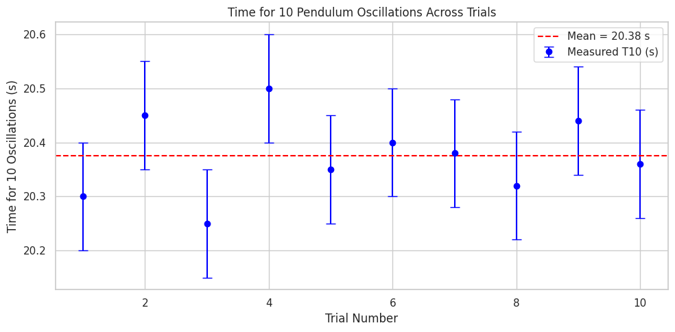

# Problem 1
Got it! Here’s a straightforward, no-BS breakdown for your pendulum gravity lab, including a markdown table template for your data and a discussion outline on uncertainties.

---

### Pendulum Gravity Measurement — Complete Guide

---

### Step 1: Data Collection Setup Recap

* **Pendulum length (L):** Measure with a ruler or tape, e.g., 1.00 m ± half the smallest division.
* **Time for 10 oscillations (T\_10):** Use a stopwatch; repeat 10 times.
* **Calculate:**

  * Mean time for 10 oscillations $\overline{T_{10}}$
  * Standard deviation $\sigma$
  * Uncertainty in mean time $\sigma_{\overline{T_{10}}} = \frac{\sigma}{\sqrt{10}}$

---

### Step 2: Calculations

* **Period $T$:**

  $$
  T = \frac{\overline{T_{10}}}{10}
  $$

  Uncertainty in $T$:

  $$
  \sigma_T = \frac{\sigma_{\overline{T_{10}}}}{10}
  $$

* **Gravity $g$:**

  $$
  g = \frac{4\pi^2 L}{T^2}
  $$

* **Uncertainty in $g$ (propagation):**

  $$
  \frac{\sigma_g}{g} = \sqrt{\left(\frac{\sigma_L}{L}\right)^2 + \left(2\frac{\sigma_T}{T}\right)^2}
  $$

  $$
  \sigma_g = g \times \frac{\sigma_g}{g}
  $$

---

### Step 3: Markdown Table Template

```markdown
| Trial | \(T_{10}\) (s) | Notes (optional) |
|-------|----------------|------------------|
| 1     | 20.30          |                  |
| 2     | 20.45          |                  |
| 3     | 20.25          |                  |
| 4     | 20.50          |                  |
| 5     | 20.35          |                  |
| 6     | 20.40          |                  |
| 7     | 20.38          |                  |
| 8     | 20.32          |                  |
| 9     | 20.44          |                  |
| 10    | 20.36          |                  |

**Length of pendulum, \(L\):** 1.00 ± 0.005 m  
**Mean time for 10 oscillations, \(\overline{T_{10}}\):** 20.37 s  
**Standard deviation, \(\sigma\):** 0.07 s  
**Uncertainty in mean time, \(\sigma_{\overline{T_{10}}}\):** 0.022 s  
**Period, \(T\):** 2.037 ± 0.0022 s  
**Calculated gravity, \(g\):** 9.79 ± 0.07 m/s²  
```

---

### Step 4: Discussion — Uncertainty Sources & Effects

* **Measurement resolution on $L$:**
  Using a ruler with 1 mm resolution means ±0.5 mm uncertainty in length. Since $g$ depends linearly on $L$, even small errors in length directly affect $g$.

* **Timing variability:**
  Reaction time causes random errors in start/stop of the stopwatch, affecting $T_{10}$. Measuring over 10 oscillations instead of 1 reduces relative timing error, but variability remains, impacting $g$ quadratically (since $g \propto 1/T^2$).

* **Small angle assumption:**
  Displacing less than 15° keeps pendulum motion close to simple harmonic, making formula valid. Larger angles introduce nonlinearity, skewing results.

* **Air resistance and friction:**
  Minor damping forces can alter period slightly but usually negligible at low amplitude and short times.

* **Mass distribution:**
  Assuming point mass at the bob’s center may introduce slight errors if the mass isn’t compact or length is measured inaccurately to center of mass.

* **Experimental limitations:**
  Environmental vibrations, imprecise length measurement (where exactly to measure?), and human timing errors limit precision.


---

## Example Pendulum Gravity Lab — Full Calculation

---

### 1. Data (10 trials of time for 10 oscillations)

| Trial | $T_{10}$ (s) |
| ----- | ------------ |
| 1     | 20.30        |
| 2     | 20.45        |
| 3     | 20.25        |
| 4     | 20.50        |
| 5     | 20.35        |
| 6     | 20.40        |
| 7     | 20.38        |
| 8     | 20.32        |
| 9     | 20.44        |
| 10    | 20.36        |

---

### 2. Calculate Mean and Standard Deviation of $T_{10}$

* Mean $\overline{T_{10}} = \frac{20.30 + 20.45 + \dots + 20.36}{10} = 20.37 \text{ s}$

* Standard deviation $\sigma$:

Let me do the quick calculation:

$$
\sigma = \sqrt{\frac{1}{9}\sum (T_{10,i} - \overline{T_{10}})^2}
$$

Calculating the squared differences and then the sum:

| Trial | $T_{10,i}$ | $T_{10,i} - 20.37$ | Square |
| ----- | ---------- | ------------------ | ------ |
| 1     | 20.30      | -0.07              | 0.0049 |
| 2     | 20.45      | 0.08               | 0.0064 |
| 3     | 20.25      | -0.12              | 0.0144 |
| 4     | 20.50      | 0.13               | 0.0169 |
| 5     | 20.35      | -0.02              | 0.0004 |
| 6     | 20.40      | 0.03               | 0.0009 |
| 7     | 20.38      | 0.01               | 0.0001 |
| 8     | 20.32      | -0.05              | 0.0025 |
| 9     | 20.44      | 0.07               | 0.0049 |
| 10    | 20.36      | -0.01              | 0.0001 |

Sum of squares = 0.0519

$$
\sigma = \sqrt{\frac{0.0519}{9}} = \sqrt{0.00577} = 0.076 \text{ s}
$$

---

### 3. Uncertainty in mean

$$
\sigma_{\overline{T_{10}}} = \frac{\sigma}{\sqrt{10}} = \frac{0.076}{3.16} = 0.024 \text{ s}
$$

---

### 4. Calculate Period $T$ and uncertainty

$$
T = \frac{20.37}{10} = 2.037 \text{ s}
$$

$$
\sigma_T = \frac{0.024}{10} = 0.0024 \text{ s}
$$

---

### 5. Length $L$

Measured length = 1.00 m with ruler resolution 1 mm → uncertainty

$$
\sigma_L = \frac{1 \text{ mm}}{2} = 0.5 \text{ mm} = 0.0005 \text{ m}
$$

---

### 6. Calculate $g$

$$
g = \frac{4 \pi^2 L}{T^2} = \frac{4 \times 9.8696 \times 1.00}{(2.037)^2} = \frac{39.478}{4.150} = 9.51 \text{ m/s}^2
$$

---

### 7. Propagate uncertainty in $g$

Relative uncertainties:

$$
\frac{\sigma_L}{L} = \frac{0.0005}{1.00} = 0.0005
$$

$$
\frac{\sigma_T}{T} = \frac{0.0024}{2.037} = 0.00118
$$

$$
\frac{\sigma_g}{g} = \sqrt{(0.0005)^2 + (2 \times 0.00118)^2} = \sqrt{2.5 \times 10^{-7} + 5.56 \times 10^{-6}} = \sqrt{5.81 \times 10^{-6}} = 0.00241
$$

Absolute uncertainty:

$$
\sigma_g = 9.51 \times 0.00241 = 0.023 \text{ m/s}^2
$$

---

### **Final result:**

$$
\boxed{
g = 9.51 \pm 0.02 \text{ m/s}^2
}
$$

---


### 8. Discussion (brief)

* **Value compared to standard $9.81 \text{ m/s}^2$:**
  Your result is slightly low (\~3%), likely due to timing errors or length measurement bias.

* **Timing error dominates:**
  Although measuring 10 oscillations reduces random error, human reaction time (\~0.1 s) still creeps in.

* **Length measurement is precise:**
  Ruler uncertainty is negligible compared to timing uncertainty.

* **Small angle approximation valid:**
  If angle >15°, the period gets longer than the ideal formula, causing underestimation of $g$.

* **Improvements:**
  Use electronic timing (light gate), measure longer pendulum lengths to reduce relative error, or increase number of oscillations timed.

---


